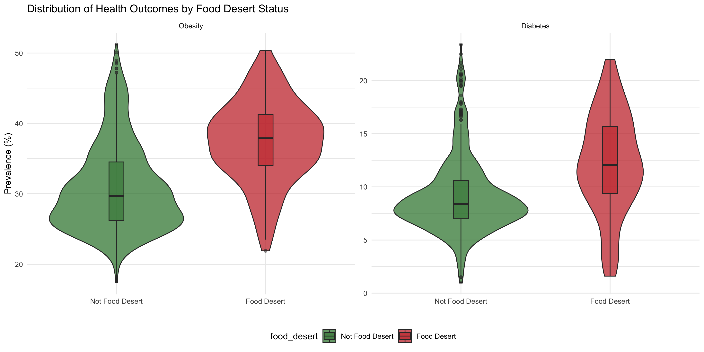
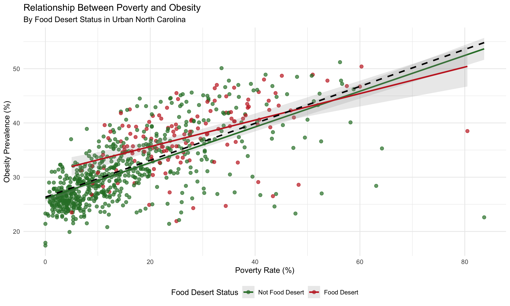
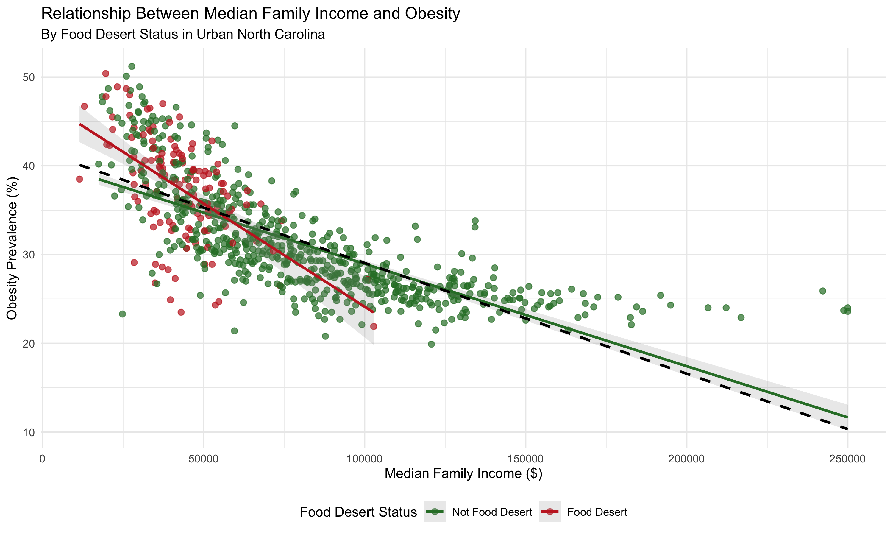
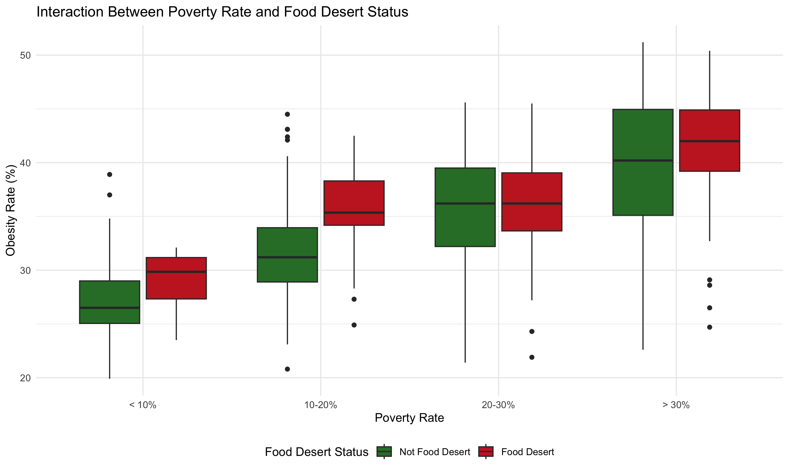
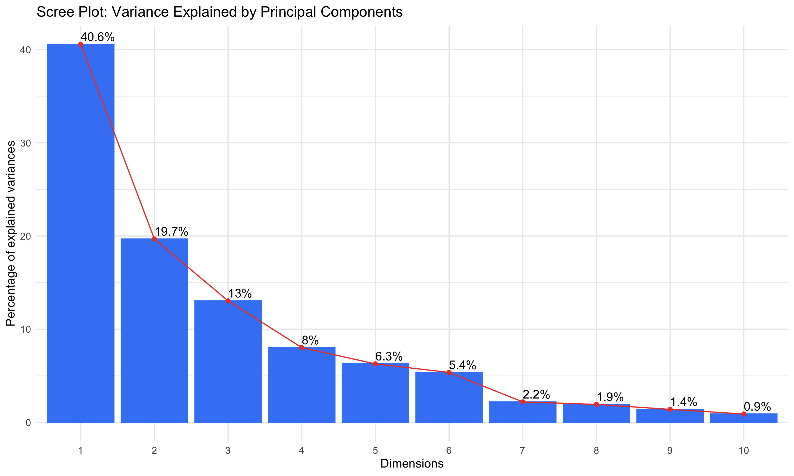
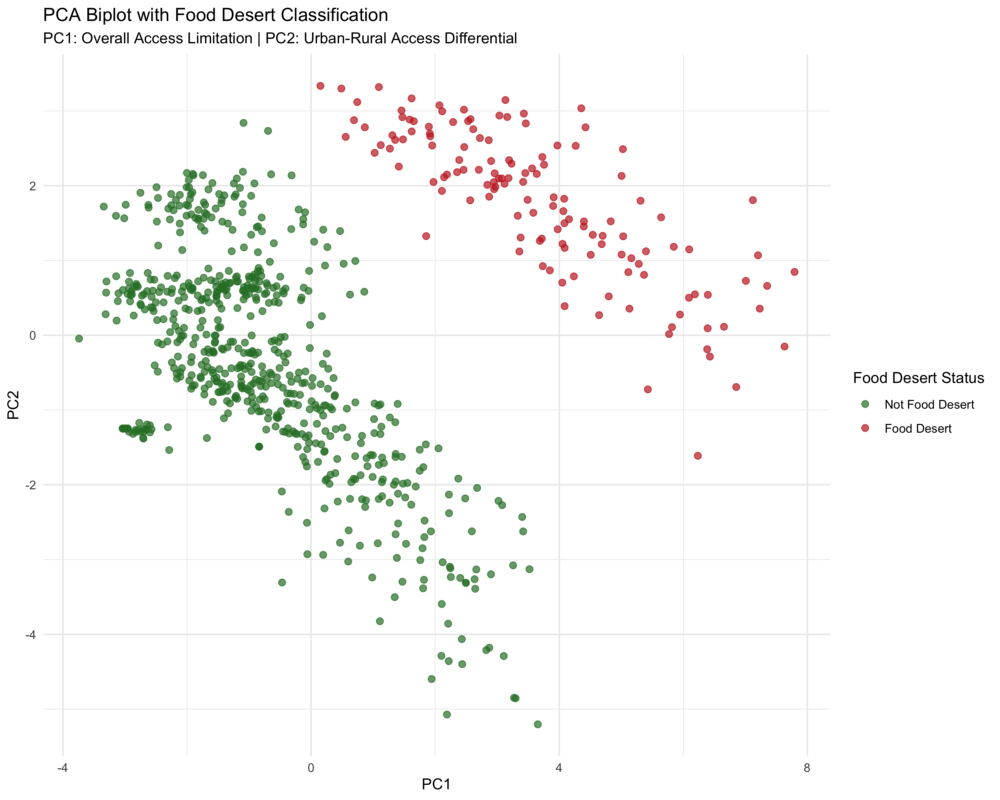
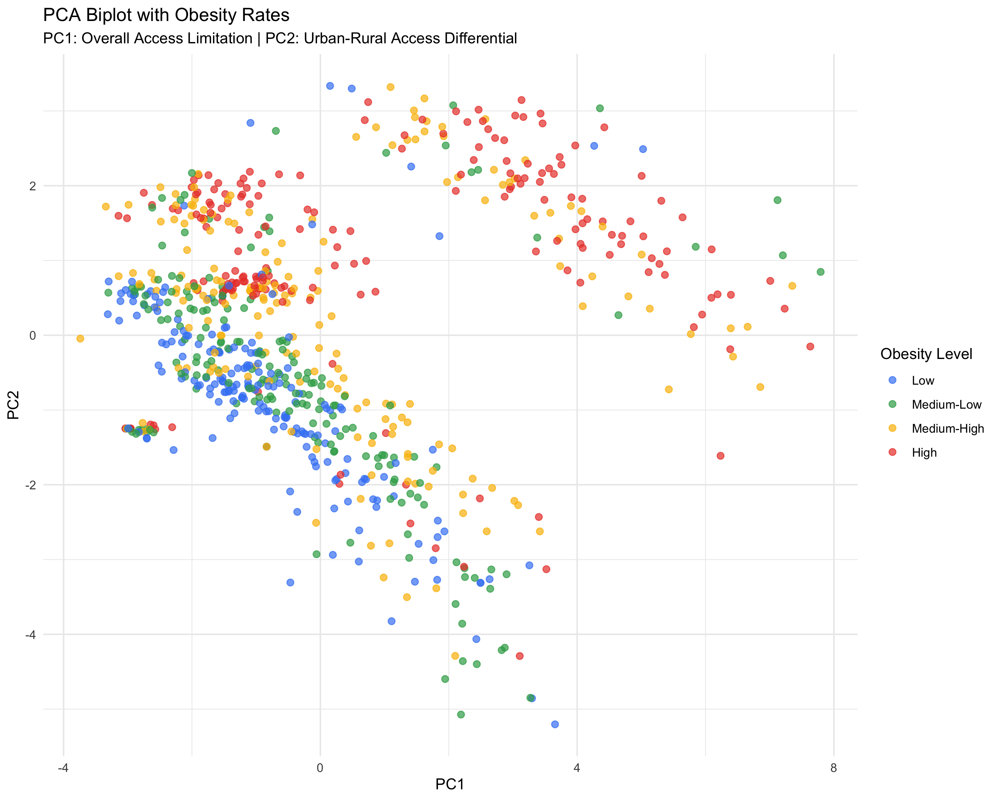

```{r setup, include=FALSE}
knitr::opts_chunk$set(echo = FALSE, warning = FALSE, message = FALSE)
```

# Summary

This analysis investigates the relationship between food access and health outcomes across North Carolina census tracts, using USDA Food Access Research Atlas and CDC PLACES health data. The study explores how living in food deserts correlates with obesity and diabetes prevalence, while accounting for socioeconomic factors. For a map of food deserts and food swamps in North Carolina, please view my supplemental map here (takes some time to load): https://johnetobin.shinyapps.io/foodInsecurityMap/

Key findings include:

1. **Clear Health Disparities:** Census tracts classified as food deserts show significantly higher obesity rates (37.4% vs. 30.9%) and diabetes rates (12.2% vs. 9.2%) compared to non-food desert areas.
2. **Multidimensional Food Access:** Principal Component Analysis revealed distinct dimensions of food access that strongly correlate with health outcomes, explaining 47% of the variance in obesity rates.
3. **Socioeconomic Influence:** When controlling for poverty and income, food desert status remains a significant predictor of obesity, highlighting that food access has independent effects beyond socioeconomic factors.
4. **Vulnerable Populations:** Specialized access patterns for different demographic groups (rural communities, low-income populations, etc.) contribute distinctly to health outcome disparities.

This evidence suggests that addressing food access should be a key component of public health initiatives in North Carolina, particularly when implemented alongside poverty reduction strategies.

# Exploratory Analysis 

## Food Desert Status and Health Outcomes



The violin plots reveal the distribution of both obesity and diabetes rates by food desert status. The plots show not only higher mean values in food desert areas but also different distribution patterns. Food desert areas display wider variability in health outcomes, particularly in the upper ranges, suggesting more extreme cases in these communities.
Statistical analysis confirms these visual patterns:

Obesity: Food desert tracts show significantly higher obesity rates (t-test: p < 0.001)
Diabetes: The pattern holds for diabetes as well (t-test: p < 0.001)

## Relationship with Socioeconomic Factors





These plots show that food desert status, poverty rate, and median family income are all associated with obesity rates, suggesting a complex relationship between socioeconomic factors, food access, and health outcomes.

# Interaction Between Poverty and Food Access



This boxplot reveals a crucial insight: the relationship between food desert status and obesity varies across different poverty levels. The gap in obesity rates between food desert and non-food desert areas is particularly pronounced in areas with moderate poverty (10-20%), while narrowing slightly in the highest poverty areas. This suggests that:

1. Food access challenges may have the strongest relative impact in moderate-poverty communities
2. In the highest-poverty areas, multiple factors beyond food access may contribute to health outcomes
3. Targeted interventions may need different approaches based on community poverty levels

# Principal Component Analysis



My analysis identified several key dimensions of food access that explain 88% of the variance in the food access variables:

1. PC1: Overall Access Limitation - Represents general food access challenges across all metrics
2. PC2: Urban-Rural Access Differential - Distinguishes between urban and rural food access patterns
3. PC3: Vulnerable Population Access - Focuses on access disparities among specific demographic groups
4. PC4: Low-Income Access Patterns - Captures access issues unique to low-income populations
5. PC5: Child vs. Senior Access - Distinguishes between access patterns for different age groups

## PCA Biplot Analysis



These biplots provide several key insights:

1. The clustering of high obesity areas (dark red points) primarily in the upper right quadrant of the first plot indicates that combinations of access dimensions (rather than single factors) are associated with the worst health outcomes.

2. Food desert tracts cluster differently from non-food desert tracts, confirming that the PCA has effectively captured meaningful patterns in food access.

3. The spread of both food desert and non-food desert points across different regions suggests that even within these categories, there is considerable variability in access patterns that may be relevant for intervention design.

# Regression Analysis

## Model Comparison

```{r model-comparison, echo=FALSE}
# Load required packages
library(knitr)
library(kableExtra)

# Read the saved model comparison tables
obesity_comparison <- read.csv("obesity_model_comparison.csv")
diabetes_comparison <- read.csv("diabetes_model_comparison.csv")

# Format and display the obesity models table
kable(obesity_comparison, caption = "Comparison of Obesity Models") %>%
  kable_styling(bootstrap_options = c("striped", "hover"), full_width = FALSE)

# Format and display the diabetes models table
kable(diabetes_comparison, caption = "Comparison of Diabetes Models") %>%
  kable_styling(bootstrap_options = c("striped", "hover"), full_width = FALSE)
```

My regression analysis progressed through increasingly complex models:

Model 1: Only food desert status (R² = 0.14 for obesity, 0.09 for diabetes)

Model 2: Food desert status + socioeconomic factors (R² = 0.63 for obesity, 0.38 for diabetes)

Model 3: PCA components only (R² = 0.47 for obesity, 0.36 for diabetes)

Model 4: Full model with all predictors (R² = 0.65 for obesity, 0.47 for diabetes)

The substantial improvement in model fit from Model 1 to Model 2 highlights the importance of socioeconomic context, while the strong performance of Model 3 demonstrates that food access dimensions capture significant health variation independent of the binary food desert classification.

# Conclusions

## Key Findings

1. **Beyond Binary Classification:** Food access challenges are multidimensional, with the PCA revealing distinct patterns that explain health outcomes better than a simple food desert designation.
2. **Independent Effect:** Even after controlling for poverty and income, food access dimensions remain significant predictors of health outcomes, confirming that food environment is not merely a proxy for socioeconomic status.
3. **Vulnerable Population Focus:** The strong association of PC3 (vulnerable population access) and PC5 (child vs. senior access) with health outcomes highlights the importance of demographic-specific interventions.
4. **Interacting Factors:** The interaction between poverty and food desert status suggests that food access challenges may have varying impacts across the socioeconomic spectrum.

## Policy Implications

Based on these findings, effective public health strategies should:

1. **Target Multiple Access Dimensions:** Address more than just proximity to stores, incorporating affordability, quality, and cultural appropriateness of available foods.
2. **Focus on Vulnerable Populations:** Develop specialized interventions for populations with unique access challenges, particularly children and seniors in low-access areas.
3. **Coordinate Economic and Food Policies:** Implement food access solutions alongside poverty reduction and income support policies for maximum impact.
4. **Consider Geographic Variation:** Recognize that urban and rural food access challenges manifest differently and require distinct approaches.

## Limitations and Future Research

This analysis has several limitations that provide opportunities for future research:

1: **Causality:** The cross-sectional design limits causal inference about the relationship between food access and health outcomes.
2. **Urban Focus:** Data availability constraints limited the analysis primarily to urban census tracts, necessitating future dedicated studies of rural food environments.
3. **Individual Behaviors:** Area-based measures don't capture individual food shopping behaviors, dietary choices, or transportation patterns.

Future research should explore:

1. Longitudinal changes in food access and health outcomes
2. The impact of food access interventions on health metrics
3. Integration of individual-level food purchasing and consumption data
4. Quality and affordability metrics beyond simple proximity measures

# Final Thoughts

This analysis provides compelling evidence that food access is an important social determinant of health in North Carolina communities. The multidimensional nature of food access revealed through PCA suggests that solutions must be similarly multifaceted, addressing not just store proximity but the full range of barriers that limit access to healthy food options. By targeting these access dimensions alongside socioeconomic factors, public health initiatives may more effectively reduce obesity and diabetes disparities across the state.